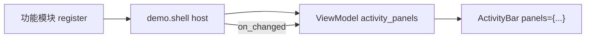
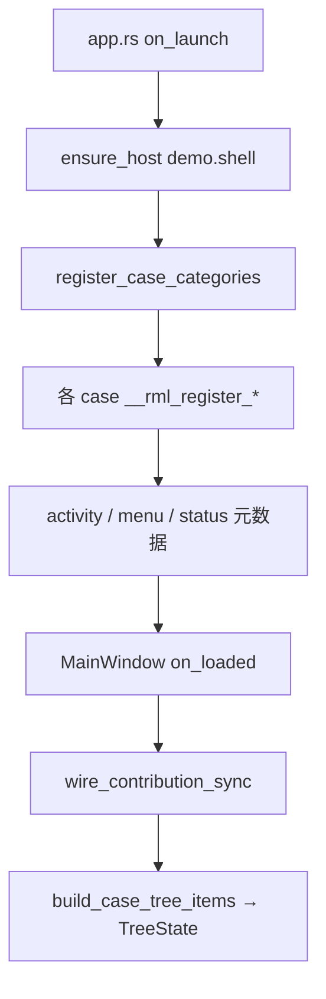

# 9.7 贡献点架构（Contribution System）

> **本章目标**：理解 RML 贡献点作为**通用扩展基础设施**的定位——框架只提供契约与运行时；UI 由 MVVM 数据绑定驱动，不预设业务 `host_id`。

## 分层：框架 vs 应用

| 层次 | 提供什么 | 不提供什么 |
|------|---------|-----------|
| **rml-core** | `IContribution`、`IContributionHost`、`IContributionRegistry`、`ContributionOptions`、`VisualMode` 元数据 | 任何 `host_id`、Shell 布局、专用呈现组件 |
| **rml-app** | `ContributionRegistry`、`ensure_host`、`build_contribution_tree` | Demo 业务、预置扩展点 |
| **rml-ui** | 窗口壳（`ModernWindow`/`TabWindow`）、MVVM 绑定适配（`Menu`/`RmlStatusBar`/`TreeView`/`ActivityBar`） | gpui-component 直译包装（声明式 `PopupMenu`/`Button` 由 engine codegen 生成） |
| **应用（Demo）** | 自定 `host_id`、ViewModel 映射、RML 声明式绑定 | — |

## 核心抽象

### `IContributionHost` — 贡献数据管理器（非 UI）

Host 维护某 `host_id` 下的**贡献元数据列表** + 变更通知（`version` / `on_changed`）：

```text
功能模块 register → Host.entries() → ViewModel 映射 → RML 控件绑定
```

**不是 UI 组件。** 所有 UI 呈现均通过 MVVM：

1. Host 变更触发 `on_changed`
2. ViewModel 读取 `entries()`，映射为控件数据类型
3. RML 声明式绑定，数据变化自动刷新 UI

### 最佳实践：活动栏



- **Host**：维护活动栏项元数据（id、name、icon、`VisualMode::Panel`）
- **ViewModel**：`build_activity_panels()` → `ActivityPanels`
- **RML**：`<ActivityBar panels={activity_panels}>`；面板内容由 Shell 在 RML 中按 `active_panel_id` 声明

案例树同理：`demo.shell` host 中 `kind=case` 条目 → `build_case_tree_items()` → `<Tree>`。

状态栏：`kind=status` 条目 → `build_status_items()` → `<status_bar items={status_items}>`。

菜单：`kind=menu` 条目 → `build_menu_items()` → `<menu items={menu_items}>`（MVVM 路径；声明式菜单见 `compiler/menu/`）。

## `#[contribute]` 宏

`#[contribute]` 为结构体生成 `IContribution` 实现及 `__rml_register_<lowercasename>` 注册函数。常与 `#[component]` 叠加在同一 struct 上：

```rust
#[contribute(
    host = "demo.shell",
    id = "components.menu.context",
    name = "case.menu.context.title",
    kind = "case",
    parent_id = "cat.menu",
    order = 16,
)]
#[component]
#[derive(Default)]
pub struct MenuContextCase { /* ... */ }
```

### 属性表

| 属性 | 类型 | 必填 | 说明 |
|------|------|------|------|
| `host` | 字符串 | 是 | 贡献注册到的 `host_id`（Demo 统一为 `demo.shell`） |
| `id` | 字符串 | 是 | 贡献唯一 id，案例树节点 id / 菜单项 id |
| `name` | 字符串 | 是 | i18n key，运行时 `t_static(name)` 作为显示名 |
| `description` | 字符串 | 否 | i18n key，描述文本 |
| `icon` | `IconName::...` | 否 | 图标名（活动栏等消费方读取） |
| `mode` | `Panel` / `Inline` / `Chrome` / `Overlay` | 否 | `VisualMode`，默认 `Panel` |
| `order` | 整数 | 否 | 同层排序权重 |
| `placement` | `Left` / `Right` | 否 | `VisualPlacement`，状态栏对齐 |
| `group` | 字符串 | 否 | 分组元数据 |
| `kind` | 字符串 | 否 | 消费方筛选键：`case` / `activity` / `menu` / `status` |
| `parent_id` | 字符串 | 否 | 树形贡献的父节点 id（案例分类 / 子案例） |

宏生成函数命名规则：`CounterCase` → `counter_case::__rml_register_countercase`。

## 案例注册流程（Demo）



1. **`ensure_host`** — 预创建 `demo.shell`（`demo/src/features/mod.rs::ensure_hosts`）
2. **分类根节点** — `contributions::register_case_categories` 注册 `cat.binding` / `cat.components` / `cat.menu` / `cat.i18n`
3. **案例组件** — 各 `*.rml.rs` 上 `#[contribute]` 生成 `__rml_register_*`，在 `features::register_all`（由 `app.rs::on_launch` 调用）中注册：

```rust
pub fn register_all(cx: &mut App) {
    contributions::register_case_categories(cx);

    counter_case::__rml_register_countercase(cx);
    two_way_case::__rml_register_twowaycase(cx);
    button_case::__rml_register_buttoncase(cx);
    i18n_case::__rml_register_i18ncase(cx);
    menu_context_case::__rml_register_menucontextcase(cx);
    menu_dropdown_case::__rml_register_menudropdowncase(cx);
    // ... 其余 menu_*_case

    case_activity_panel::__rml_register_caseactivitypanel(cx);
}
```

4. **ViewModel 消费** — `CaseActivityPanel` 调用 `contributions::build_case_tree_items`；`MainWindow` 监听 `demo.shell` 的 `on_changed` 刷新菜单/状态/活动栏绑定。

案例 `name` 使用 `case.*.title` i18n key（如 `case.menu.context.title`），分类节点使用 `tree.cat.*` key。

## 统一注册 API

```rust
registry.register(host_id, Arc::new(contribution), options, cx);  // T: Registerable
```

`visual_mode` / `placement` / `properties["kind"]` 是**消费方元数据**，不是框架渲染指令。

## `ContributionOptions`

```rust
ContributionOptions::new()
    .order(1)
    .parent_id("parent-id")
    .property("kind", "case")
    .visual_mode(VisualMode::Panel)   // 供 ViewModel 筛选/映射
    .placement(VisualPlacement::Left)
```

## Demo 参考（非框架契约）

`demo/src/shell/contributions.rs` — 单 host `SHELL_HOST = "demo.shell"`，提供 `build_case_tree_items` / `build_activity_panels` 等映射。

`demo/src/shell/bindings.rs` — 旧式分 host 映射（`activity-bar` / `status`），逐步迁移至 `contributions.rs`。

`demo/src/shell/main_window.rml`：

```xml
<ActivityBar panels={activity_panels} on_panel_change="on_panel_change">
    <div if={active_panel_id == "samples"} class="nav-tree">
        <Tree on_activate="on_case_activate" />
    </div>
</ActivityBar>
<status_bar items={status_items} />
```

## 参考代码

- 契约：`crates/core/src/contribution.rs`
- 宏：`crates/macros/src/contribute.rs`
- 运行时：`crates/app/src/contribution/`
- Demo 范例：`demo/src/shell/contributions.rs`、`demo/src/features/mod.rs`、`demo/src/cases/*_case.rml.rs`
